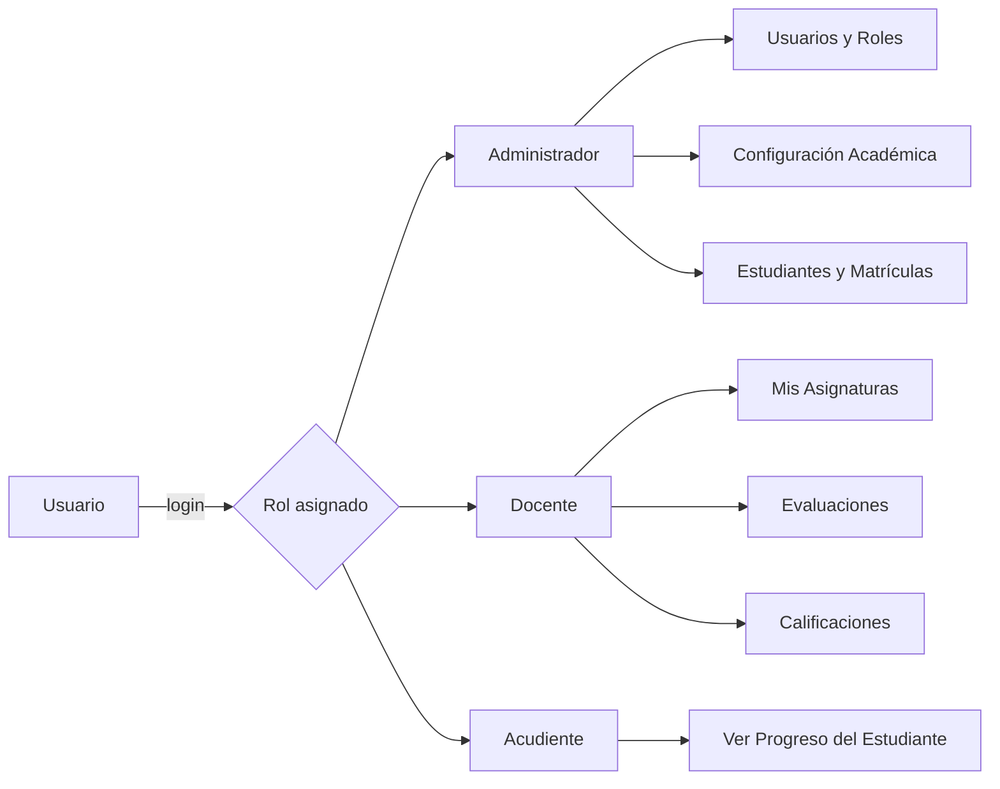
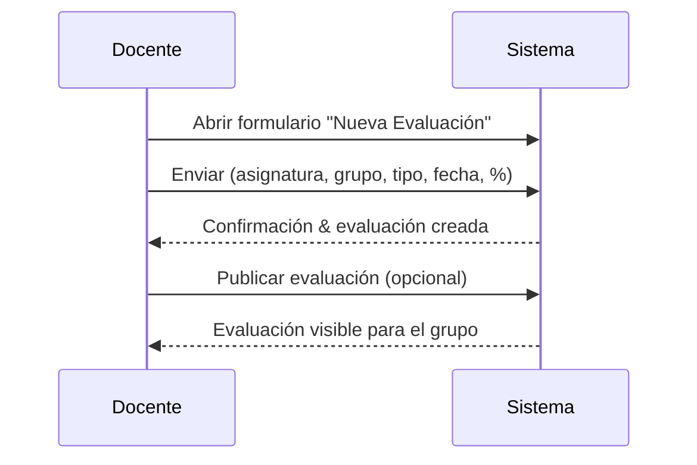

# Manual de Usuario — Sistema de Gestión Escolar

Bienvenido al **Sistema de Gestión Escolar**. Este manual está pensado para usuarios Administrativos, Docentes y Acudientes; explica, paso a paso, las tareas habituales y muestra diagramas `mermaid` para visualizar flujos importantes.

> **Nota**: La documentación técnica se encuentra en `TECHNICAL_DOCS.md`. Aquí sólo está el manual de usuario.

---

## Índice

- [Manual de Usuario — Sistema de Gestión Escolar](#manual-de-usuario--sistema-de-gestión-escolar)
  - [Índice](#índice)
  - [🔐 Acceso al Sistema](#-acceso-al-sistema)
  - [👤 Credenciales de Prueba (Demo)](#-credenciales-de-prueba-demo)
  - [👥 Roles y Permisos](#-roles-y-permisos)
    - [Administrador](#administrador)
    - [Docente](#docente)
    - [Acudiente](#acudiente)
  - [🎓 Gestión de Estudiantes](#-gestión-de-estudiantes)
    - [Registrar un estudiante (Administrador)](#registrar-un-estudiante-administrador)
    - [Registrar estudiante — flujo visual](#registrar-estudiante--flujo-visual)
    - [Editar / Ver ficha del estudiante](#editar--ver-ficha-del-estudiante)
  - [📚 Gestión Académica (orden recomendado)](#-gestión-académica-orden-recomendado)
  - [📝 Evaluaciones y Calificaciones](#-evaluaciones-y-calificaciones)
    - [Crear una Evaluación (Docente)](#crear-una-evaluación-docente)
    - [Calificar (Docente)](#calificar-docente)
    - [Crear evaluación — secuencia rápida](#crear-evaluación--secuencia-rápida)
  - [🆘 Soporte y Buenas Prácticas](#-soporte-y-buenas-prácticas)
    - [Soporte](#soporte)
    - [Buenas prácticas de seguridad](#buenas-prácticas-de-seguridad)
  - [✅ Recomendaciones finales](#-recomendaciones-finales)
  - [Licencia](#licencia)

---

## 🔐 Acceso al Sistema

1. Abra la página de inicio de sesión de la plataforma.
2. Ingrese sus credenciales:
   - **Usuario**: nombre de usuario asignado (ej. `admin`, `docente1`)
   - **Contraseña**: su clave personal
3. Presione **Iniciar sesión**.

> Si olvida su contraseña, utilice la opción de recuperación (si está disponible) o contacte al área de sistemas.

---

## 👤 Credenciales de Prueba (Demo)

- **Administrador**  
  Usuario: `admin`  
  Contraseña: `admin123`

- **Docente**  
  Usuario: `docente1`  
  Contraseña: `docente123`

> ⚠ Estas credenciales son sólo para entorno de pruebas. No se deben usar en producción.

---

## 👥 Roles y Permisos

La interfaz y las acciones variarán según el rol asignado.



### Administrador

- Gestión de usuarios y roles.
- Gestión académica (áreas, asignaturas, grados).
- Gestión de estudiantes y matrículas.
- Configuración general del sistema.

### Docente

- Crear evaluaciones.
- Registrar y editar calificaciones.
- Consultar listas de estudiantes y material de sus asignaturas.

### Acudiente

- Consultar notas y seguimiento del estudiante.
- Ver comunicados y calendario (según permisos y versión).

---

## 🎓 Gestión de Estudiantes

### Registrar un estudiante (Administrador)

Pasos rápidos:

1. Ir a **Menú → Estudiantes**.
2. Click en **Nuevo Estudiante**.
3. Completar **Información Personal**: nombres, apellidos, género, fecha de nacimiento.
4. Completar **Documento**: tipo y número (TI, CC, RC, etc.).
5. Asignar **Acudiente**: usar la búsqueda inteligente (escriba el nombre y seleccione). **El acudiente debe estar creado previamente** en módulo _Acudientes_.
6. Asignar grupo/matrícula.
7. Guardar.

### Registrar estudiante — flujo visual

```mermaid
flowchart TD
  A[Inicio: Menú Estudiantes] --> B[Click "Nuevo Estudiante"]
  B --> C[Completar Información Personal]
  C --> D[Completar Documento]
  D --> E{Asignar acudiente?}
  E -->|Sí| F[Buscar acudiente y seleccionar]
  E -->|No| G[Advertencia: crear acudiente primero]
  F --> H[Asignar grupo/matrícula]
  H --> I[Guardar registro]
  G --> Z[Crear acudiente → volver a asignar]
  I --> J[Fin: Estudiante creado]
```

### Editar / Ver ficha del estudiante

- En la lista de estudiantes: botones **Ver**, **Editar**, **Eliminar**.
- Pestañas típicas en la ficha: _Datos personales_, _Documentos_, _Acudientes_, _Matrículas_, _Historial académico_, _Observaciones_.
- Cambios importantes (p.ej. número de documento) deben registrarse con evidencia y, si aplica, autorización administrativa.

---

## 📚 Gestión Académica (orden recomendado)

Para configurar el año escolar correctamente se recomienda el siguiente orden:

1. **Áreas** — Definir grandes áreas (Matemáticas, Humanidades, Ciencias, etc.).
2. **Asignaturas** — Crear materias (ej. Álgebra, Inglés) y asociarlas a un área.
3. **Grados** — Definir niveles (Primero, Segundo...).
4. **Grado–Asignatura** — Asociar qué materias tiene cada grado.
5. **Grupos** — Crear grupos por grado (ej. 6‑01, 6‑02).
6. **Docentes** — Registrar y asignar docentes a grupos y asignaturas.
7. **Matrículas** — Inscribir estudiantes en los grupos correspondientes.

> Sugerencia: antes de abrir matrículas, revise que todas las asignaturas y grupos estén correctamente configurados para evitar inconsistencias.

---

## 📝 Evaluaciones y Calificaciones

### Crear una Evaluación (Docente)

1. Ir a **Evaluaciones → Nuevo**.
2. Seleccionar:
   - **Asignatura**
   - **Grupo**
3. Definir:
   - **Tipo** (Examen, Taller, Tarea, Parcial)
   - **Fecha** y (opcional) duración
   - **Porcentaje** o ponderación respecto a la nota final
   - **Descripción** y recursos adjuntos (si aplica)
4. Guardar y publicar (si desea que esté visible para estudiantes/acudientes).

### Calificar (Docente)

1. Ir a **Calificaciones**.
2. Seleccionar la evaluación creada.
3. Ver la lista de estudiantes del grupo.
4. Ingresar la nota por estudiante (rango 0.0 – 5.0 o según escala de la institución).
5. Guardar.
6. Revisar el cálculo de promedios si aplica (automático, según la configuración de ponderaciones).

### Crear evaluación — secuencia rápida



---

## 🆘 Soporte y Buenas Prácticas

### Soporte

Si encuentras un error o tienes dudas operativas:

1. Reúne la información:
   - Rol (Administrador / Docente / Acudiente)
   - Módulo o pantalla afectada
   - Pasos para reproducir el problema
   - Mensajes de error (si hay)
   - Captura de pantalla o video corto (si es posible)

2. Envía la solicitud al canal de soporte establecido (correo, ticket o chat interno).
3. Incluye la información recopilada para acelerar la resolución.

**Correo de soporte ejemplo**: `soporte@institucion.edu` _(sustituir por el real)_

### Buenas prácticas de seguridad

- Usa contraseñas fuertes y cámbialas periódicamente.
- No compartas tus credenciales.
- Mantén actualizado tu correo y teléfono en perfil.
- Cierra sesión en equipos compartidos.
- Reporta accesos sospechosos inmediatamente.
- En producción: asegúrate de HTTPS, CSP, HSTS y cabeceras de seguridad activas.

---

## ✅ Recomendaciones finales

- Antes de iniciar el año lectivo: configura Áreas → Asignaturas → Grados → Grado–Asignatura → Grupos → Docentes → Matrículas.
- Prueba las funcionalidades críticas (registro de estudiantes, creación de evaluaciones, cálculo de notas) en un entorno de staging antes de producción.
- Mantén un `CHANGELOG.md` operativo para registrar cambios y nuevas versiones.
- Define un responsable (admin) para la gestión de datos maestros (áreas, asignaturas, grados).

---

## Licencia

MIT

---
